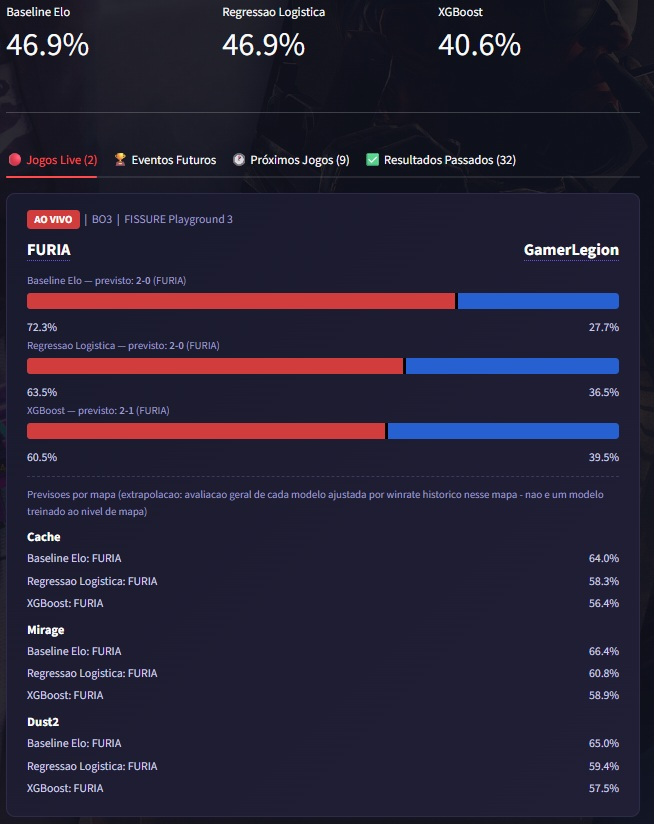

# 🎯 CS2 Tier-1 Match Predictor & Live Dashboard

[](https://www.python.org/)
[](https://streamlit.io/)
[](https://scikit-learn.org/)
[](https://xgboost.ai/)
[](https://github.com/features/actions)
[](LICENSE)

An end-to-end Machine Learning pipeline and automated live dashboard that predicts professional **Counter-Strike 2 (CS2)** Tier-1 match outcomes. 

The system continuously scrapes match and tournament data from [HLTV.org](https://www.hltv.org), engineers temporal features without data leakage, trains multi-model classifiers, and serves real-time predictions via an interactive Streamlit dashboard. A GitHub Actions MLOps pipeline runs hourly (24/7) to record predictions and dynamically audit production model accuracy against actual match results over time.

---

## 🖼️ Dashboard Preview

  
*Note: Run `streamlit run app.py` locally to launch the interactive live dashboard, or view the live prediction logs in [`data/previsoes_log.csv`](data/previsoes_log.csv).*

---

## 💡 Key Highlights & Engineering Philosophy

Most open-source esports prediction projects suffer from two critical flaws: **small/outdated datasets** and **data leakage** (using post-match or future information to predict past games). This project addresses both issues through rigorous data science standards:

1. **Strict Chronological Data Pipeline**: All engineered features (dynamic Elo, form, head-to-head stats) are computed chronologically. For any match on day $D$, only information available *prior* to $D$ is utilized.
2. **Post-Veto Leakage Prevention**: Map win-rate features are strictly excluded from pre-match production models, as map choices are only finalized during vetoes right before game start.
3. **Temporal Train/Test Split**: Models are evaluated using an 80/20 temporal split (training on earlier matches, testing on future matches) rather than randomized splits, ensuring realistic out-of-sample performance estimation.
4. **24/7 Continuous Production Tracking**: Beyond backtesting, a scheduled GitHub Actions workflow continuously records live predictions and tracks **real-world production accuracy**.

---

## ⚙️ Architecture & Pipeline Overview

```
                          ┌───────────────────────┐
                          │   HLTV.org Scraper    │ (Cloudflare Bypass via cf_clearance)
                          └───────────┬───────────┘
                                      │
                                      ▼
                          ┌───────────────────────┐
                          │ Match & Map Builder   │ (Temporal Grouping & Forfeit Filtering)
                          └───────────┬───────────┘
                                      │
                                      ▼
                          ┌───────────────────────┐
                          │  Feature Engineering  │ (Dynamic Elo, Recent Form, H2H)
                          └───────────┬───────────┘
                                      │
           ┌──────────────────────────┼──────────────────────────┐
           ▼                          ▼                          ▼
 ┌───────────────────┐      ┌───────────────────┐      ┌───────────────────┐
 │ Baseline Elo Model│      │Logistic Regression│      │ XGBoost Classifier│
 └─────────┬─────────┘      └─────────┬─────────┘      └─────────┬─────────┘
           │                          │                          │
           └──────────────────────────┼──────────────────────────┘
                                      │
                                      ▼
                          ┌───────────────────────┐
                          │  Streamlit Dashboard  │ ◄── Auto-Refresh & Roster Tooltips
                          └───────────┬───────────┘
                                      │
              ┌───────────────────────┴───────────────────────┐
              ▼                                                 ▼
 ┌─────────────────────────┐                    ┌─────────────────────────────┐
 │  Hourly GitHub Action   │                    │   Daily GitHub Action       │
 │  Predictions + Accuracy │                    │  Dataset Growth + Retrain   │
 │        Tracking         │                    │  (LogReg + XGBoost)         │
 └─────────────────────────┘                    └─────────────────────────────┘
```

---

## 📊 Model Benchmarks & Methodology

Models were evaluated on a temporal holdout set (last 20% of chronological matches):

| Model | Architecture / Method | Accuracy | Log Loss | Brier Score | Status |
|---|---|:---:|:---:|:---:|:---:|
| **Logistic Regression** | Dynamic Elo + Form + H2H | **63.2%** | **0.645** | **0.226** | **Primary Production Model** |
| **XGBoost** | Tuned via `GridSearchCV` (`max_depth=2`) | 61.3% | 0.645 | — | Secondary Benchmark |
| **Baseline Elo** | Higher dynamic Elo team wins | 61.3% | — | — | Baseline Control |
| **Logistic Regression + Players** | Dynamic Elo + Avg Player Ratings | 62.1% | 0.644 | — | Experimental (Redundant) |

### Key Findings & Methodology Highlights:
- **Logistic Regression Leader**: Logistic Regression achieved the optimal balance between accuracy, probabilistic calibration (Brier Score `0.226` vs. `0.250` for random guessing), and interpretability.
- **XGBoost Hyperparameter Convergence**: Hyperparameter tuning converged to shallow tree depth (`max_depth=2`), indicating that added complexity yields no marginal gain on this dataset size (~3,000 matches).
- **Player-Level Features Redundancy**: Aggregating individual player ratings did not improve predictive performance over team dynamic Elo, as team Elo already encapsulates collective roster strength over time.
- For complete technical documentation, see [`docs/METODOLOGIA.md`](docs/METODOLOGIA.md) and [`notebooks/01_eda.ipynb`](notebooks/01_eda.ipynb).

---

## 📁 Repository Structure

```
.
├── .github/
│   └── workflows/
│       ├── atualizar_previsoes.yml       # Hourly: prediction tracking & accuracy audit
│       └── atualizar_dataset.yml         # Daily: dataset growth & model retraining
├── assets/
│   ├── background.jpg                    # Dashboard background image
│   └── preview.jpg                       # Dashboard screenshot (README preview)
├── data/
│   ├── features_dataset.csv              # Processed feature dataset (chronological)
│   ├── matches_clean.csv                 # Cleaned match-level dataset
│   ├── mapas_raw.csv                     # Raw map-level stats (grows daily)
│   ├── previsoes_log.csv                 # Prediction tracking log & outcome audit
│   ├── modelo_producao.pkl               # Logistic Regression production model
│   └── modelo_producao_xgb.pkl           # XGBoost production model
├── docs/
│   ├── METODOLOGIA.md                    # Full methodology, experiments & decisions (PT)
│   └── RENOVAR_COOKIE.md                 # Cloudflare cookie renewal guide (PT)
├── notebooks/
│   └── 01_eda.ipynb                      # Exploratory data analysis & calibration
├── scripts/
│   ├── atualizar_previsoes.py            # Standalone script run hourly by GH Actions
│   └── atualizar_dataset_historico.py    # Standalone script run daily by GH Actions
├── src/
│   ├── models/
│   │   ├── train_baseline.py             # Baseline + Logistic Regression evaluator
│   │   ├── tune_xgboost.py               # Hyperparameter tuning (TimeSeriesSplit)
│   │   ├── train_production_model.py     # Logistic Regression production training
│   │   └── train_production_xgboost.py   # XGBoost production training
│   ├── processing/
│   │   ├── build_features.py             # Feature engineering (Elo, form, H2H)
│   │   ├── build_matches.py              # Map-to-match reconstruction
│   │   ├── predict_upcoming.py           # Real-time prediction pipeline (3 models)
│   │   └── team_rosters.py               # Live roster lookup (incl. stand-in detection)
│   ├── scraper/
│   │   ├── fetcher.py                    # Cloudflare-authenticated request wrapper
│   │   ├── get_upcoming_matches.py       # Upcoming/live matches scraper
│   │   ├── parse_map_stats.py            # Historical map-stats scraper/parser
│   │   └── track_predictions.py          # Production accuracy logger
│   └── experiments/                      # Documented experiments, not in production
│       ├── README.md
│       ├── test_roster_stability.py
│       ├── train_with_players.py
│       ├── collect_players.py
│       └── parse_players.py
├── app.py                                # Interactive Streamlit dashboard
├── requirements.txt
├── LICENSE
└── README.md
```

---

## 🚀 Quickstart & Local Setup

### Prerequisites
- **Python 3.10+**
- Active internet connection (for live match scraping)

### 1. Installation

Clone the repository and install dependencies:

```bash
# Clone repository
git clone https://github.com/ppxdpp17/CS2-Predictor.git
cd CS2-Predictor

# Create and activate virtual environment
python -m venv venv

# On Windows:
venv\Scripts\activate

# On Linux/macOS:
source venv/bin/activate

# Install dependencies
pip install -r requirements.txt
```

### 2. Configure Cloudflare Session Cookie

Live scraping requires a valid HLTV `cf_clearance` cookie.

1. Create a `.env` file in `src/scraper/.env`:
   ```env
   CF_CLEARANCE=your_cf_clearance_cookie_here
   USER_AGENT=your_browser_user_agent_here
   ```
2. For detailed instructions on obtaining the cookie via Browser DevTools, refer to [`docs/RENOVAR_COOKIE.md`](docs/RENOVAR_COOKIE.md).

---

## 💻 Running the Dashboard

Launch the interactive Streamlit dashboard:

```bash
streamlit run app.py
```

### Dashboard Features:
- 🔴 **Live & Upcoming Games**: Real-time listing of scheduled and active Tier-1 matches.
- 👥 **Lineup Tooltips**: Hover over team names to inspect predicted player rosters.
- 📈 **Multi-Model Predictions**: View win probabilities for **Baseline Elo**, **Logistic Regression**, and **XGBoost** side by side.
- 🎯 **Score Heuristics**: Automatically derived series scores (e.g., `2-0`, `2-1`, `3-1`) based on model confidence and match format (Bo1/Bo3/Bo5).
- 🏆 **Production Accuracy Metric Cards**: Live tracking of real-world model accuracy across confirmed matches.

---

## 🔄 Automated Continuous Tracking (MLOps)

This project runs two independent GitHub Actions workflows, requiring no manual intervention beyond periodic Cloudflare cookie renewal:

### Hourly: Prediction Tracking (`.github/workflows/atualizar_previsoes.yml`)
- Scrapes newly announced upcoming/live matches and records predictions from all 3 models
- Checks outcomes of previously predicted matches
- Updates real-world production accuracy in [`data/previsoes_log.csv`](data/previsoes_log.csv)
- Commits updated logs back to the repository

### Daily: Dataset Growth & Retraining (`.github/workflows/atualizar_dataset.yml`)
- Checks HLTV for newly finished Tier-1 matches since the last collection
- Appends new data to the historical dataset and rebuilds engineered features
- Retrains both production models (Logistic Regression + XGBoost) on the updated dataset
- Skips retraining entirely if no new matches are found (avoids unnecessary commits)

To enable both workflows, configure these repository secrets under **Settings → Secrets and variables → Actions**:
- `CF_CLEARANCE`
- `USER_AGENT`

---

## 📌 Limitations & Future Improvements

- **Dataset Era**: Features CS2 matches post-October 2023 (~3,000 matches). Larger historical datasets will allow deeper model architectures.
- **Round-Level Economy**: Current features are calculated at match/map resolution; round-by-round economy data is not included.
- **Pre-Veto Constraints**: Individual map predictions rely on win-rate heuristics because veto decisions occur immediately prior to match start.

---

## 📜 License

This project is open-source software licensed under the [GNU Affero General Public License v3.0](LICENSE).
